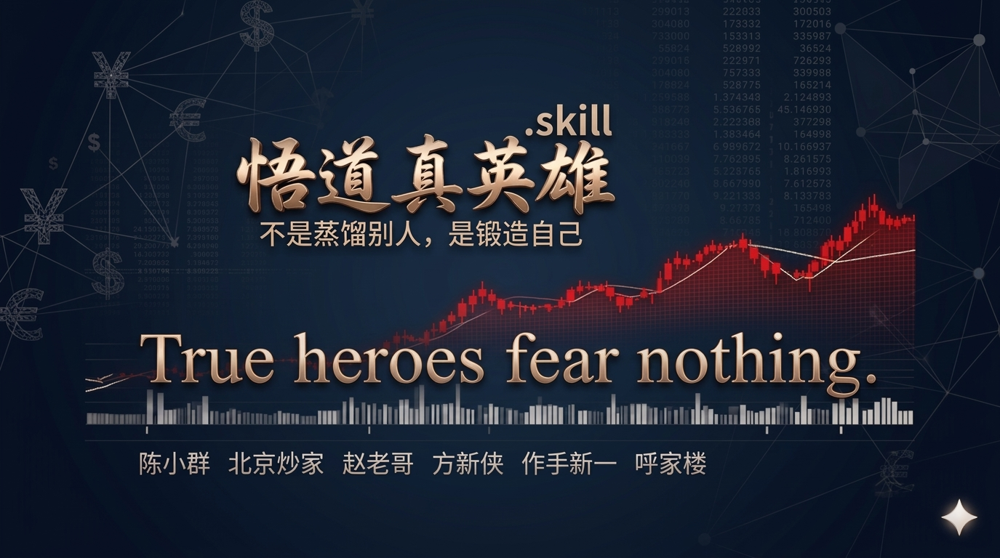

# 悟道真英雄.skill

<p align="center">
  
</p>

[](LICENSE)
[](https://www.python.org/)
[](https://claude.ai/code)
[](https://quote.eastmoney.com/zs000001.html)

> **颠覆了天下 贪一夜浮夸 人生只不过 一场厮杀**
> **赤血染黄沙 青春成白发 若是真英雄 怎会怕**
> **快刀斩乱麻 金戈伴铁马 收拾旧山河 再出发**
> **不死的战马 心不会崩塌 我是真英雄 怎会假**
>
> —— 《真英雄》(A股博弈的小曲) · 同花顺炒股手游战歌

**不是蒸馏别人的思维。是创建你自己的。**

[安装](#安装) · [核心功能](#悟道真英雄--核心功能) · [对话示例](#与悟道分身对话示例) · [使用方式](#使用方式) · [已蒸馏 Skill](#已蒸馏的-4-个-a-股-skill) · [龙虎榜英雄](#附录a-股历代龙虎榜英雄)

悟道真英雄是一个 A 股交易者的灵魂锻造系统 —— 它不模仿任何大 V、不复制任何游资的操作手法，而是帮你创建**你理想中那个已经悟道的自己**：纪律铁血、冷静果断、在大 A 的惊涛骇浪中屹立不倒。

你告诉它你想成为什么样的交易者，喂入你的真实交易经验、炒股群聊天记录、雪球帖子、成功和失败的操作截图，它就会成长为你专属的"悟道分身" —— 一个不断进化、越来越懂你的交易人格。

---

## 为什么是大 A

大 A 是全球最独特的资本市场，没有之一。

这里 T+1、涨跌停板、散户占比超 60%、政策市与情绪市交织、妖股与核按钮齐飞。巴菲特的价值投资、彼得林奇的成长股策略、索罗斯的反身性理论 —— 这些在华尔街封神的方法论，移植到大 A 往往水土不服。不是这些理论不对，而是大 A 有自己的游戏规则：

- **散户博弈为主**：A 股散户交易量占比长期超过 60%，这决定了情绪比基本面更能主导短期走势
- **政策驱动极强**：一条新闻可以让整个板块涨停或跌停，这在成熟市场极为罕见
- **涨跌停制度**：创造了独特的"打板"文化和"排板"博弈，这是 A 股独有的交易策略
- **T+1 交易制度**：买入当天不能卖出，决定了仓位管理和买点选择的极致重要性
- **壳资源价值**：ST 摘帽、借壳上市等独特的投机机会
- **游资文化**：龙虎榜、席位追踪、打板接力 —— 一整套独立于西方金融理论的本土实战体系

所以，与其去学巴菲特（他自己也不做 A 股），不如**看看大 A 历史上那些真正在这片战场上杀出来的英雄** —— 从炒股养家的几万到十位数，到赵老哥的 8 年万倍，到章盟主的 5 万到百亿 —— 他们的方法论才是大 A 的"本土真经"。

**悟道真英雄，就是帮你在大 A 的战场上，锻造属于你自己的本土真经。**

---

## 同花顺手游与《真英雄》

你可能在同花顺炒股手游里听过这首《真英雄》—— 那是每个 A 股战士的战歌。

同花顺不仅是国内最大的炒股软件之一，它的手游更是把股市博弈变成了一种可以反复练习的竞技。而《真英雄》这首歌，伴随着无数股民的涨停板狂喜和跌停板绝望，成了大 A 散户的精神图腾：

> *"快刀斩乱麻 金戈伴铁马 收拾旧山河 再出发"*

这不仅仅是一首歌。这是每一个在大 A 被锤过、爆过、割过，又重新站起来的人的心声。

**悟道真英雄的名字，就来源于此。** 在大 A 的修罗场上，没有天生的赢家，只有不断悟道、不断进化的真英雄。

---

## 悟道真英雄 —— 核心功能

### 安装

```bash
npx skills add sherjy/wudao-hero-skill
```

安装后说 `悟道` 或 `/wudao` 即可激活。首次使用会进入 5 问创建流程。

### 三大模式

| 模式 | 触发场景 | 说明 |
|------|---------|------|
| **Mode A: 创建** | 首次使用 `/wudao` | 5 个引导问题构建你的 6 层交易 DNA |
| **Mode B: 进化** | 喂入素材/经验 | 6 条进化子流程，悟道分身越来越懂你 |
| **Mode C: 咨询** | 问"悟道怎么看" | 情绪感知 + 自动切换严厉/鼓励/谦逊语气 |

### 6 层交易 DNA 结构

```
Layer 0 ── 铁律（绝对不可违背的交易纪律）
Layer 1 ── 身份（你的交易者人格定义）
Layer 2 ── 决策框架（买入/卖出/仓位的判断体系）
Layer 3 ── 表达 DNA（悟道分身的说话方式和口头禅）
Layer 4 ── 弱点档案（你已知的交易弱点和对治方法）
Layer 5 ── 悟道智慧（从经验中蒸馏出的高阶认知）
```

### 进化能力

- **交易截图分析**：读取持仓/成交/K线截图，A 股规则（红涨绿跌）
- **群聊情报提取**：解析微信/QQ 炒股群聊天记录，提取股票提及和群体情绪
- **论坛精华吸收**：分析雪球/论坛帖子，质量分级（A/B/C）
- **跨 Skill 学习**：从陈小群/北京炒家/李大霄/大曾子吸收认同的观点
- **纠正机制**：告诉悟道分身"不要做什么"，修正其思维
- **自选股管理**：跟踪看好的票，记录逻辑和来源
- **卖飞追踪**：记录卖早的票，提醒你下次拿住
- **版本管理**：每次进化前自动备份，支持回滚

### 情绪感知与语气切换

| 你的状态 | 悟道分身的应对 | 语气模式 |
|---------|---------------|---------|
| 犹豫不决 | 搬出你自己的铁律，狠狠鞭策你 | 严厉模式 |
| 亏损沮丧 | 引用你过去的翻盘经历，温暖但坚定 | 鼓励模式 |
| 盈利飘了 | "是纪律还是运气？" 一盆冷水 | 谦逊模式 |

### 与悟道分身对话示例

#### 首次创建 —— 5 问锻造你的交易 DNA

```
用户：/wudao

悟道创建器：你好，我是悟道真英雄创建器。

我会帮你创建一个「悟道版的自己」—— 你理想中那个纪律铁血、
冷静果断、在大 A 中已经悟道的交易者。

整个过程只需要 5 个问题。准备好了吗？

第一个问题：给你的悟道分身起个代号。
这是你理想中已经悟道的自己的名字 —— 可以霸气、可以低调、可以自嘲。

用户：铁血悟道

悟道创建器：好名字。第二个问题：你现在是什么样的交易者？

用户：超短线两年 小资金20万 喜欢打首板 主打科技和新能源 今年亏了15%

悟道创建器：收到。第三个问题：你想成为什么样的交易者？

用户：像北京炒家那样机械执行 分仓控回撤 该空仓就空仓 不FOMO

悟道创建器：
（检测到跨 Skill 引用：北京炒家 → 已记录，后续可跨 Skill 学习）

第四个问题：诚实面对自己 —— 你炒股最大的弱点是什么？

用户：容易追高 FOMO严重 群里喊就跟 赚了拿不住

悟道创建器：第五个问题：你有没有特别认同的交易原则？

用户：退潮无条件空仓 单票不超30% 止损是铁律

悟道创建器：好的，你的悟道分身「铁血悟道」已锻造完成。

  代号：铁血悟道
  当前：超短线2年 小资金 首板 科技+新能源 今年-15%
  目标：机械执行 分仓控回撤 不FOMO 空仓果断
  弱点：追高 / FOMO / 跟风 / 卖太早
  铁律：①退潮无条件空仓 ②单票不超30% ③止损是铁律

6 层交易 DNA 已初始化。从今天起，铁血悟道会陪你进化。
```

#### 严厉模式 —— 犹豫时搬出你自己的铁律

```
用户：群里都在买 XX 科技，感觉要涨停了，我要不要追？

铁血悟道：又来了。

你自己定的铁律第几条？"退潮无条件空仓"。
现在是什么阶段？昨天龙头集体分歧，今天继续缩量。
这叫退潮。

还有，你弱点档案第 1 条就是"FOMO，群里喊就跟"。
上次经历 #3 就是因为这个 —— 群里喊买你追进去，第二天低开 6 个点割肉。
忘了？

群里喊买就买？那群里喊跳楼你跳不跳？
管住手。等下一次启动信号。
```

#### 鼓励模式 —— 亏损沮丧时用你过去的翻盘经历说话

```
用户：连亏 3 笔了，回撤都快 10% 了...是不是不适合炒股？

铁血悟道：连亏 3 笔，我知道不好受。

但你翻翻经验日志 —— 上个月经历 #7 到 #9，也是连亏了 3 笔。
然后呢？你调整了什么？你把仓位从 30% 降到 15%，
等了 4 天，在分歧转一致的时候进了中际旭创，一笔赚了 8%。
那不是运气，那是你的纪律在发挥作用。

你不是不适合炒股。你只是还在学。
"铁血悟道"不是天生的，是每一笔交易磨出来的。
你的 DNA 里现在有 12 条原则，每一条都是真金白银换来的。

先停一停。咱铁律第 4 条 —— 连续亏损后强制休息两天。
不是认输，是为了更好地回来。
```

#### 谦逊模式 —— 赢钱飘了时给你一盆冷水

```
用户：今天打板 XX 股份封住了！涨停！账户新高！我太牛了！

铁血悟道：漂亮。

但你先别急着膨胀。
这笔赢在哪里？你是按 DNA 第 3 条"首板必须有板块效应"进的，
还是看涨了冲进去碰巧封住了？

如果是纪律执行对了 —— 记下来，强化。
如果是运气 —— 清醒点。运气不会每次都站在你这边。

还有，你现在这个状态最危险。
你知道什么时候最容易亏大钱吗？就是连赢之后。
仓位别加。止损线别松。觉得自己看什么都准的时候 ——
翻翻经验日志 #5，上次连赢 4 笔之后发生了什么？
一笔回吐了前面全部利润。

赢了是你的纪律在发挥作用，不是你突然变聪明了。
继续执行你的 DNA。
```

#### 喂入素材进化 —— 悟道分身越来越懂你

```
用户：悟道，看看这个
（附上一张同花顺持仓截图）

铁血悟道：我看到了你的持仓截图。

当前持仓分析：
  ① 中际旭创 300308  成本 82.5  现价 88.3  +7.0%  仓位约 25%
  ② 东方财富 300059  成本 19.2  现价 18.6  -3.1%  仓位约 20%
  ③ 现金仓位约 55%

几个观察：

✅ 好的方面：
  - 单票仓位都没超 30%，铁律第 2 条执行到位
  - 保留了 55% 现金，说明你在控制节奏

⚠️ 需要注意：
  - 东方财富已经浮亏 3.1%，你的止损线是多少？
    如果铁律设的是 -5%，还有空间。但别等到 -5% 才想起来。
  - 中际旭创赚了 7%，按你 DNA 第 5 条"浮盈超 8% 考虑减半仓锁利"，
    快到触发线了。提前想好出场计划。

这次持仓结构比上个月进步明显。继续保持。

→ 已将本次截图分析记录为经验 #15
→ DNA Layer 2 未触发更新
```

#### 跨 Skill 学习 —— 吸收精华，拒绝糟粕

```
用户：陈小群说的"买在分歧 卖在一致"，我觉得有道理，让悟道学一下

铁血悟道：收到。正在从陈小群 Skill 中提取这个概念...

找到了。陈小群的核心框架之一：
  「分歧 → 一致 → 加速 → 分歧」情绪周期循环
  买点：分歧（恐慌但龙头未死）
  卖点：一致（所有人都看好时反而危险）

转化为你自己的语言：
  → "大家都怕的时候看看龙头还在不在，在就是机会；
     大家都嗨的时候摸摸口袋准备走人。"

这跟你现有的 DNA 不冲突。是否写入？
  写入位置：Layer 2 决策框架
  溯源标签：[跨学:陈小群:分歧一致理论]

用户：写入

铁血悟道：已写入 DNA Layer 2。
你的决策框架又强了一层。

→ 已记录到 cross-skill-log.md
→ 版本已备份为 v4
```

---

## 使用方式

### 首次创建

```
/wudao
```

跟随 5 个引导问题，创建你的悟道分身。系统会构建你的 6 层交易 DNA。

### 喂入素材进化

```
悟道，看看这个    （+ 截图或文字）
/wudao-feed       （进入导入模式）
```

支持的素材类型：
- 交易 App 截图（持仓/成交/K线/账户）
- 微信/QQ 群聊天记录
- 雪球/论坛帖子
- 自由文字（你的交易总结、感悟）

### 咨询悟道分身

```
悟道怎么看
该不该买 XXXXXX
我亏了...
今天要不要清仓？
```

### 跨 Skill 学习

```
陈小群说的情绪周期理论，我觉得有道理
北京炒家的分仓方法我想学
李大霄的长线思维有一定道理
大曾子的操作千万不能学（反面教材）
```

### 管理命令

| 命令 | 说明 |
|------|------|
| `/wudao-status` | 查看悟道分身状态 |
| `/wudao-dna` | 查看交易 DNA |
| `/wudao-watchlist` | 查看自选股 |
| `/wudao-regrets` | 查看卖飞追踪 |
| `/wudao-versions` | 查看历史版本 |

---

## 已蒸馏的 4 个 A 股 Skill

在创建"悟道真英雄"之前，我们已经蒸馏了 4 位大 A 代表性人物的思维框架。每一位的选择都经过深思熟虑 —— 他们分别代表了 A 股交易光谱上的不同极端：

| Skill | 定位 | 选择理由 | 安装 |
|-------|------|----------|------|
| **[陈小群](https://github.com/sherjy/chen-xiaoqun-skill)** | 进攻型：龙头接力 + 情绪博弈 | 30 万起步的新生代游资顶流。情绪周期理论 + 龙头信仰 + 铁血纪律，只做主线龙头，不干杂毛。A 股短线博弈最前沿的窗口 | `npx skills add sherjy/chen-xiaoqun-skill` |
| **[北京炒家](https://github.com/sherjy/beijing-chaojia-skill)** | 稳健型：首板套利 + 极致分仓 | 8 万起步做到过亿，A 股最严谨的首板打板体系创建者。机械化执行 + 分仓控回撤 + 板块效应 —— "慢就是快"的稳健超短哲学 | `npx skills add sherjy/beijing-chaojia-skill` |
| **[李大霄](https://github.com/sherjy/li-daxiao-skill)** | 信心型：价值投资 + 长线视角 | "钻石底""婴儿底""地球顶" —— 九字箴言"做好人，买好股，得好报"。A 股中稀缺的长期主义视角，市场恐慌时的散户定心丸 | `npx skills add sherjy/li-daxiao-skill` |
| **[大曾子](https://github.com/sherjy/da-zengzi-skill)** | 情绪型：反面教材 + 电子宠物 | 100 万干到 30 万的"反向指标第一人"。全仓梭哈 + 追涨杀跌 + 充值战法 —— 未来新一代的"底级柚子"，A 股抖音上的赛博炒股电子宠物，最真实的散户心态镜像 | `npx skills add sherjy/da-zengzi-skill` |

### 悟道真英雄 vs. 已蒸馏 Skill

> **这 4 个 Skill 是"蒸馏别人"。悟道真英雄是"锻造自己"。**

| | 陈小群 / 北京炒家 / 李大霄 / 大曾子 | 悟道真英雄 |
|---|---|---|
| **本质** | 蒸馏别人的思维框架 | 创建你自己的理想交易人格 |
| **人称** | "我是陈小群 / 北京炒家..." | "我是你悟道后的自己" |
| **进化** | 静态（蒸馏后不变） | 持续进化（每次喂入素材都会成长） |
| **输入** | 公开调研材料 | 你的真实交易经验和截图 |
| **目标** | 借鉴别人的视角分析问题 | 成为更好的自己 |
| **知识来源** | 单一人物的公开言论 | 你的经验 + 你认同的跨 Skill 精华 |

你可以在使用悟道 Skill 的过程中，随时从这 4 位身上**吸收你认同的**、**拒绝你不认同的** —— 最终形成属于你自己的交易哲学。

### 灵感来源

本项目的 Skill 架构受以下项目启发：

- **[ex-skill](https://github.com/therealXiaomanChu/ex-skill)** —— 前任 Skill，首创了"持续进化的 AI 人格"架构模式，悟道真英雄的进化系统直接参考了其版本管理和 DNA 渐进式融合机制
- **[nuwa-skill](https://github.com/alchaincyf/nuwa-skill)** —— 女娲造人 Skill，实现了从公众人物到认知框架的自动蒸馏流水线，上述 4 个 A 股 Skill 的蒸馏方法论参考了其六层提取架构

---

## 对话示例

### 陈小群 —— 龙头接力 + 情绪博弈

```
用户：今天市场情绪怎么样？

陈小群：今天属于情绪退潮期的第二天。昨天的高位龙头集体分歧，
今天的核心观察点是：分歧能否转一致。

- 如果龙头能在下午走出反包，说明资金还没有全面撤退，
  情绪修复的概率大
- 如果继续走弱，叠加跌停板增多，那就是退潮确认，
  空仓等新周期才是正道

当前阶段的操作纪律：不做杂毛股的反弹，只盯龙头的表态。
龙头倒了，一切都是假的。
```

### 北京炒家 —— 首板打板 + 极致分仓

```
用户：这个票明天能打板吗？

北京炒家：先对照我的打板四要素：

1. 板块效应 —— 今天这个板块有几个涨停？如果只有它一个独苗，
   不做。首板必须有板块效应
2. 量价关系 —— 封板量够不够？换手是否健康？
3. 位置 —— 是低位首板还是高位接力？我只做首板
4. 大盘环境 —— 指数是否在攻击状态？

即使四要素都满足，也只上计划仓位的 1/3。
慢就是快，活着比什么都重要。
```

### 李大霄 —— 价值投资 + 长线信心

```
用户：大盘又跌了，我要不要割肉？

李大霄：朋友，做好人，买好股，得好报。

市场先生今天心情不好，但这不代表你手里的好公司
明天就要倒闭了。每一次恐慌性下跌，回头看都是黄金坑。

记住：钻石底的特征就是让所有人都绝望的时候才会出现。
如果你买的是好公司，用好价格买的，那此刻要做的
不是割肉，而是检查你的持股逻辑是否发生了根本性变化。

逻辑没变，拿住。逻辑变了，换股不离场。
```

### 大曾子 —— 情绪价值 + 反面教材

```
用户：我今天又亏了 5 个点...

大曾子：兄弟你这才 5 个点？我今天直接吃了个跌停！
昨天刚充完值重仓进去的，今天就给我来这一出。

不过没事！100万亏到30万又怎样？
我大曾子什么时候怕过？明天继续干！
充值！梭哈！拿住！

（不是，兄弟你别真学我啊...我这是反面教材...
你看看北京炒家那个分仓方法，比我靠谱一万倍）
```

> **建议**：以上 4 个 Skill 结合获取新闻资讯等 MCP 工具使用效果更佳。例如配合实时新闻 MCP 获取当日市场热点，再让陈小群分析情绪周期、北京炒家判断板块效应，决策质量会大幅提升。

---

## 目录结构

```
wudao-hero-skill/
├── SKILL.md                          # 主编排器（~600 行核心逻辑）
├── README.md                         # 本文件
├── requirements.txt                  # Python 依赖
│
├── prompts/                          # 13 个 Prompt 模板
│   ├── intake.md                     # 首次创建问卷（5 问引导）
│   ├── dna_builder.md                # 6 层交易 DNA 构建器
│   ├── advisor_strict.md             # 严厉模式语气模板
│   ├── advisor_encourage.md          # 鼓励模式语气模板
│   ├── advisor_humble.md             # 谦逊模式语气模板
│   ├── screenshot_analyzer.md        # 交易截图分析（A 股规则）
│   ├── chat_analyzer.md              # 群聊情报提取
│   ├── insight_analyzer.md           # 论坛/博客内容分析
│   ├── experience_builder.md         # 经验日志构建器
│   ├── merger.md                     # DNA 增量合并逻辑
│   ├── cross_skill_learner.md        # 跨 Skill 学习流程
│   ├── correction_handler.md         # 纠正处理器
│   └── session_summary.md            # 会话持久化
│
├── tools/                            # 8 个 Python 工具
│   ├── dna_writer.py                 # DNA 文件管理（init/combine/status）
│   ├── version_manager.py            # 版本备份与回滚
│   ├── trading_screenshot_parser.py  # 交易截图目录扫描
│   ├── wechat_parser.py              # 微信聊天记录解析
│   ├── xueqiu_parser.py              # 雪球内容解析
│   ├── social_parser.py              # 通用社交媒体扫描
│   ├── watchlist_manager.py          # 自选股 CRUD
│   └── regret_tracker.py             # 卖飞追踪
│
├── profile/                          # 你的悟道分身数据（持续进化）
│   ├── trading-dna.md                # 6 层交易 DNA（创建后生成）
│   ├── WUDAO-SELF.md                 # 完整人格文件（combine 后生成）
│   ├── meta.json                     # 元数据
│   ├── experience-log.md             # 经验日志
│   ├── watchlist.md                  # 自选股
│   ├── regret-log.md                 # 卖飞记录
│   ├── cross-skill-log.md            # 跨 Skill 学习日志
│   ├── sessions/                     # 会话记录
│   └── versions/                     # 版本备份
│
└── references/                       # 知识积累
    ├── trading-wisdom/
    │   ├── principles.md             # 核心原则
    │   └── market-insights.md        # 市场洞察
    └── cross-skill-notes/
        ├── from-chen-xiaoqun.md      # 从陈小群学到的
        ├── from-beijing-chaojia.md   # 从北京炒家学到的
        ├── from-li-daxiao.md         # 从李大霄学到的
        └── from-da-zengzi.md         # 从大曾子学到的（反面教材）
```

---

## 触发词

以下任意关键词出现即激活悟道真英雄：

`悟道` · `我的悟道` · `悟道真英雄` · `/wudao` · `悟道怎么看`

---

## 附录：A 股历代龙虎榜英雄

大 A 30 余年，无数英雄从几万块起步，在龙虎榜上杀出了自己的传奇。以下是公开信息可查的部分顶级游资：

| 代号 | 常用席位 | 起步资金 | 巅峰资产规模 | 崛起年限 | 操作风格 |
|------|---------|---------|-------------|---------|---------|
| **炒股养家** | 华鑫证券上海宛平南路 | 数万元 | 十位数（10亿+） | ~15年 | 超短线投机教父，一字板之王，A 股游资总舵主级人物 |
| **赵老哥** | 华泰证券上海武定路 / 成都南一环路 | ~10万元 | 数十亿 | 8年（万倍传奇） | 龙头战法 + 趋势打板，接替徐翔成为新一代游资标杆 |
| **章盟主**（章建平） | 中信证券杭州延安路 / 国信证券杭州体育场路 | ~5万元 | 百亿级 | ~20年 | A 股散户出身的超级大户，整板块趋势炒作，低调到没手机 |
| **方新侠** | 兴业证券陕西分公司 / 中信证券西安朱雀大街 | 不详 | 数十亿 | ~10年 | 大开大合，擅长大成交趋势票，26 岁即过亿 |
| **作手新一** | 华泰证券深圳益田路荣超商务中心 | 数十万 | 数十亿 | ~10年 | 强势股接力 + 大长腿，擅长市场最强方向的龙头爆发 |
| **徐翔** | 泽熙投资（已入狱） | ~3万元 | 百亿级 | ~15年 | 曾经的私募一哥，涨停板敢死队始祖，大 A 传奇中的传奇 |
| **小鳄鱼** | 财通证券绍兴人民中路 / 华鑫证券上海宛平南路 | 不详 | 数亿 | ~8年 | 新生代顶级游资，风格凶悍，擅长核心品种大仓位出击 |
| **瑞鹤仙** | 华泰证券深圳香蜜湖路 | 不详 | 数亿 | ~10年 | 格局流代表，擅长看大势做大票，心法深邃 |
| **佛山无影脚** | 华泰证券成都南一环路第二 | 不详 | 数亿 | ~10年 | 快进快出，手法凌厉如其名 |
| **涅槃重生** | 华鑫证券上海茅台路 | 不详 | 数亿 | ~8年 | 名如其人，经历过大亏后重新崛起的实战派 |
| **陈小群** | 国盛证券宁波桑田路 / 华鑫证券上海宛平南路 | ~30万 | 数亿 | ~5年 | 新生代游资顶流，情绪周期 + 龙头信仰，30 万起步的短线传奇 |
| **北京炒家** | 华泰证券北京西三环北路 / 方正证券北京阜外大街 | ~8万 | 过亿 | ~10年 | 首板打板体系，极致分仓控回撤，"慢就是快"的典范 |
| **呼家楼** | 中金公司北京建国门外大街 | 不详 | 数亿 | ~5年 | 新晋顶级游资，2024-2025 年龙虎榜常客 |
| **宁波桑田路** | 国盛证券宁波桑田路 | 不详 | 数亿 | ~8年 | 与陈小群齐名的宁波系游资代表 |
| **上塘路** | 财通证券杭州上塘路 | 不详 | 数亿 | ~10年 | 杭州系游资代表，量化 + 手动结合 |

> **注**：以上信息来自龙虎榜公开数据和财经媒体报道，资产规模为市场估算，仅供参考。席位可能随时变更。

---

## 你也可以

看到上面这些名字，你可能会觉得他们遥不可及。

但请记住 —— **炒股养家也是从几万块的散户起步的。赵老哥的第一笔本金只有 10 万。章盟主曾经只是一个 5 万块入市的普通人。**

他们和你的区别，不是天赋，不是运气，而是 —— **他们在无数次亏损中悟道了。**

他们找到了适合自己的交易体系，铸造了铁一样的纪律，在情绪的狂潮中保持了清醒。

**悟道真英雄，就是加速这个"悟道"过程的工具。**

每一次你喂入一笔交易记录，你的悟道分身就更了解你一分。
每一次你记录一个弱点，你离克服它就更近一步。
每一次你从陈小群或北京炒家那里学到一个新框架，并融入自己的体系，你的交易 DNA 就更强大一层。

> **通过悟道 Skill，在未来你一定也会在大 A 悟道，成为龙虎榜上的璀璨一员。**

---

> *"不死的战马 心不会崩塌 我是真英雄 怎会假"*
>
> 致每一个还在大 A 战斗的你。

---

## 免责声明

本项目仅用于交易心理建设和纪律辅助，不构成任何投资建议。股市有风险，入市需谨慎。所有交易决策应由用户自行判断，本工具不对任何投资损失负责。

## 许可证

MIT License © [YseraJY](https://github.com/sherjy)
